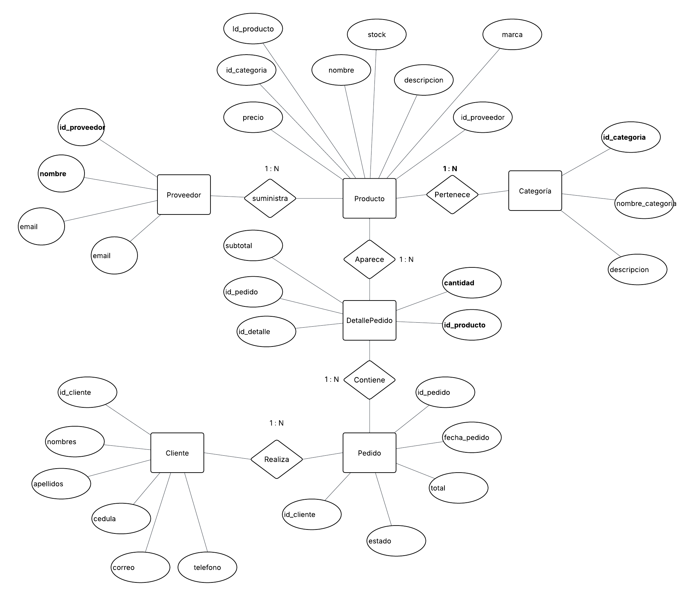

## Análisis Comparativo (SQL vs NoSQL)

A continuación, se presenta una tabla comparativa entre el modelo relacional (SQL) y el modelo NoSQL, aplicado al caso de estudio **TechStore**, una tienda de productos tecnológicos con inventario variable y datos semi-estructurados.

| **Criterio** | **SQL** | **MongoDB (NoSQL)** | **Justificación para “TechStore”** |
|---------------|----------|---------------------|------------------------------------|
| **Flexibilidad de esquema** | Estructura rígida, requiere ALTER TABLE para modificar columnas. | Esquema flexible, basado en documentos JSON dinámicos. Si un atributo de la entidad cambia o se agrega otro, no afecta a las demas entidades | Los productos tienen distintos atributos (RAM, pantalla, accesorios, etc.), lo que requiere flexibilidad. |
| **Modelo de datos** | Tablas con relaciones fijas entre entidades. | Documentos y subdocumentos que representan toda la información en una sola estructura. | Un documento por producto simplifica la organización y reduce dependencias entre tablas. |
| **Escalabilidad** | Aumentar potencia del servidor. | Se puede distribuir entre varios nodos. | Permite escalar fácilmente ante el crecimiento del catálogo y las ventas. |
| **Consultas** | Requiere sentencias JOIN para combinar datos. | Acceso directo a datos dentro de un mismo documento. | Evita uniones complejas y mejora el rendimiento de lectura. |
| **Integridad referencial** | Alta, con claves primarias y foráneas. | Se maneja mediante referencias o embebidos. | No se necesita integridad estricta; las referencias son suficientes para el inventario. |
| **Rendimiento** | Óptimo para transacciones y operaciones consistentes. | Rápido en operaciones de lectura y escritura masiva. | Ideal para análisis y consultas de productos, sin necesidad de transacciones pesadas. |
| **Tipo de datos** | Estructurados y fijos. | Semi-estructurados o no estructurados. | TechStore maneja descripciones, imágenes y especificaciones variadas. |
| **Mantenimiento** | Complejo al modificar el modelo de datos. | Sencillo, gracias al esquema dinámico. | Facilita la adaptación ante nuevos tipos de productos o características. |

> Para el caso de **TechStore**, el modelo **NoSQL (MongoDB)** ofrece mayor adaptabilidad, escalabilidad y rendimiento en comparación con SQL, dado el carácter variable del inventario y la naturaleza semi-estructurada de los datos de los productos.

## Diseño del Modelo Relacional (Conceptual)

Usando **Lucidchart**, se creao un **Diagrama Entidad-Relación (DER)** del sistema **TechStore**, representando las entidades principales, sus relaciones y cardinalidades.



## Diseño del Modelo NoSQL (MongoDB)

A continuación, se presenta la **estructura base** del documento y dos ejemplos específicos que demuestran la **flexibilidad del esquema**.

---

### Estructura general del documento
```json
// Colección: productos
{
  "_id": ObjectId(),
  "nombre": "Laptop Acer Aspire 5",
  "marca": "Acer",
  "precio": 850,
  "stock": 12,
  "descripcion": "Laptop ligera con pantalla Full HD y procesador Intel Core i7",
  "categoria": {
    "nombre_categoria": "Laptops",
    "descripcion": "Computadoras portátiles para uso académico y profesional"
  },
  "proveedor_id": ObjectId("672fb0109f1a2c45e2a67b01"), // referencia al proveedor
  "fecha_creacion": ISODate("2025-10-28T00:00:00Z")
}
