## Análisis Comparativo (SQL vs NoSQL)

A continuación, se presenta una tabla comparativa entre el modelo relacional (SQL) y el modelo NoSQL, aplicado al caso de estudio **TechStore**, una tienda de productos tecnológicos con inventario variable y datos semi-estructurados.

| **Criterio** | **SQL** | **MongoDB (NoSQL)** | **Justificación para “TechStore”** |
|---------------|----------|---------------------|------------------------------------|
| **Flexibilidad de esquema** | Estructura rígida, requiere ALTER TABLE para modificar columnas. | Esquema flexible, basado en documentos JSON dinámicos. Si un atributo de la entidad cambia o se agrega otro, no afecta a las demas entidades | Los productos tienen distintos atributos (RAM, pantalla, accesorios, etc.), lo que requiere flexibilidad. |
| **Modelo de datos** | Tablas con relaciones fijas entre entidades. | Documentos y subdocumentos que representan toda la información en una sola estructura. | Un documento por producto simplifica la organización y reduce dependencias entre tablas. |
| **Escalabilidad** | Aumentar potencia del servidor. | Se puede distribuir entre varios nodos. | Permite escalar fácilmente ante el crecimiento del catálogo y las ventas. |
| **Consultas** | Requiere sentencias JOIN para combinar datos. | Acceso directo a datos dentro de un mismo documento. | Evita uniones complejas y mejora el rendimiento de lectura. |
| **Integridad referencial** | Alta, con claves primarias y foráneas. | Se maneja mediante referencias o embebidos. | No se necesita integridad estricta; las referencias son suficientes para el inventario. |
| **Rendimiento** | Óptimo para transacciones y operaciones consistentes. | Rápido en operaciones de lectura y escritura masiva. | Ideal para análisis y consultas de productos, sin necesidad de transacciones pesadas. |
| **Tipo de datos** | Estructurados y fijos. | Semi-estructurados o no estructurados. | TechStore maneja descripciones, imágenes y especificaciones variadas. |
| **Mantenimiento** | Complejo al modificar el modelo de datos. | Sencillo, gracias al esquema dinámico. | Facilita la adaptación ante nuevos tipos de productos o características. |

> Para el caso de **TechStore**, el modelo **NoSQL (MongoDB)** ofrece mayor adaptabilidad, escalabilidad y rendimiento en comparación con SQL, dado el carácter variable del inventario y la naturaleza semi-estructurada de los datos de los productos.

## Diseño del Modelo Relacional (Conceptual)

Usando **Lucidchart**, se creó un **Diagrama Entidad-Relación (DER)** del sistema **TechStore**, que representa las entidades principales, sus relaciones y cardinalidades.


## Diseño del Modelo NoSQL (MongoDB)

A continuación, se presenta la **estructura base** del documento y dos ejemplos específicos que demuestran la **flexibilidad del esquema**.

---

### Estructura general del documento
```json
// Colección: productos
{
  "_id": ObjectId(),
  "nombre": "Laptop Acer Aspire 5",
  "marca": "Acer",
  "precio": 850,
  "stock": 12,
  "descripcion": "Laptop ligera con pantalla Full HD y procesador Intel Core i7",
  "categoria": {
    "nombre_categoria": "Laptops",
    "descripcion": "Computadoras portátiles para uso académico y profesional"
  },
  "proveedor_id": ObjectId("672fb0109f1a2c45e2a67b01"), // referencia al proveedor
  "fecha_creacion": ISODate("2025-10-28T00:00:00Z")
}
```
---

## Resultados de la Ejecución

Se usaron las operaciones respectivas para la coleccion **productos**, como esta tiene un campo llamado id_proveedor  se tuvo que insertar un dato en al coleccion **proveedor** a manera de ejemplo del sistema **TechStore**.

### Insercion del Proveedor de prueba

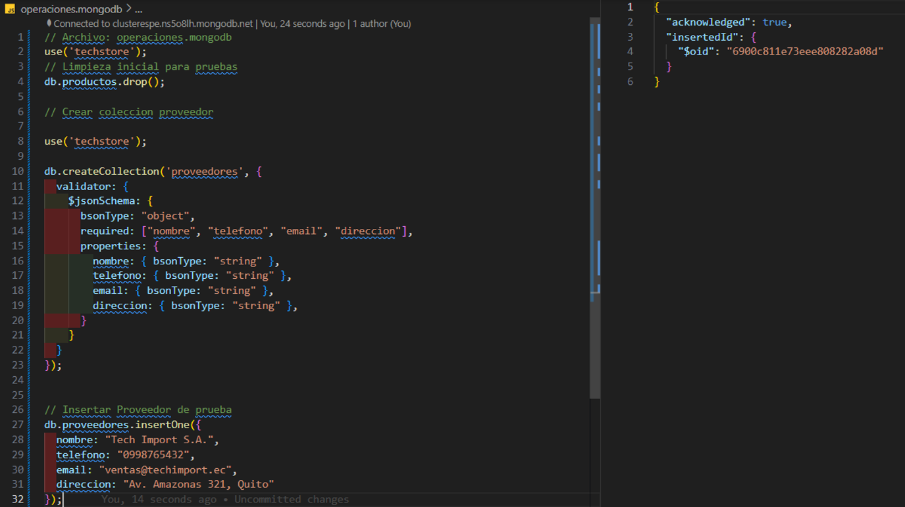

### Insercion de Datos

Se realizo una busqueda del proveedor por medio de su nombre y se retorna ese documento, luego se llama su id y se almacena en una variable para ser llama despues en las inserciones.

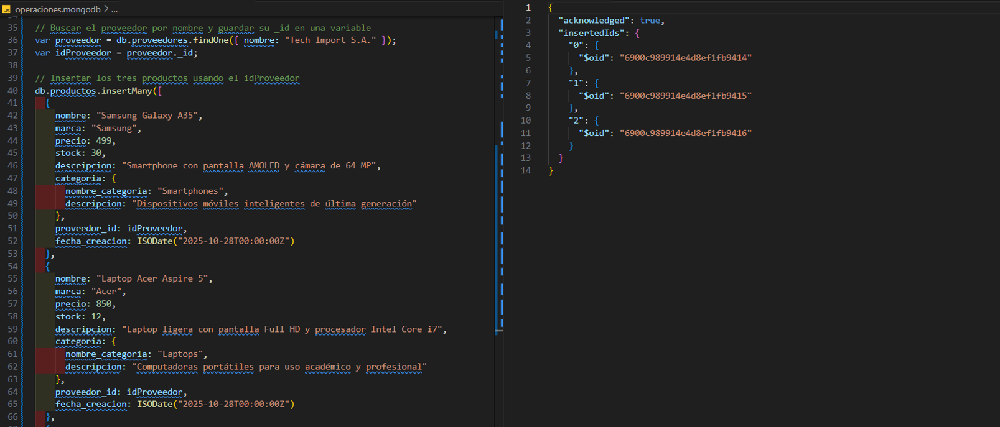

### Lectura de Datos

#### Mostrar todos los datos

Se listado de todos los documentos de la coleccion.


#### Mostrar todos los productos de tipo laptop

Se listado de todos los documentos que coinciden con la categoria Laptops.

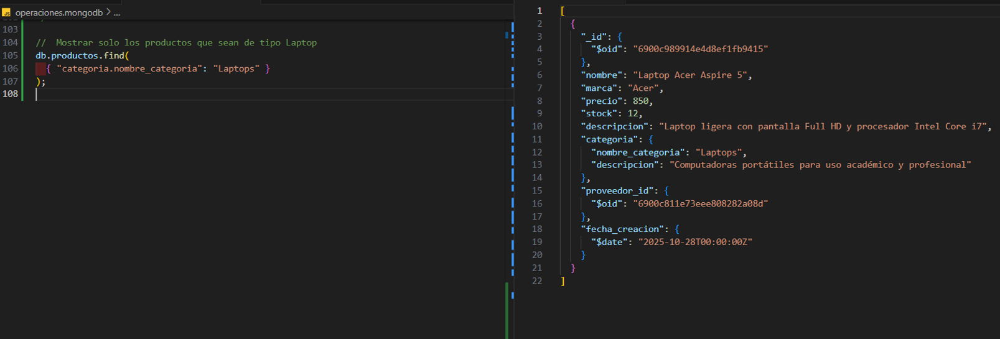

#### Mostrar productos mayores a 10 unidades y menores que 1000

Se listado de todos los documentos que el stock sea mayor a 10 unidades y menor que 1000.

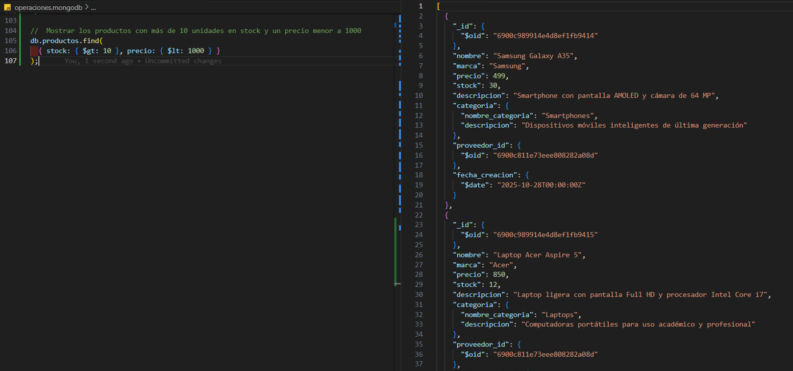

### Actualización de Datos
#### Visualizar datos

Visualizar el stock antes de los smartphones antes de actualizar.

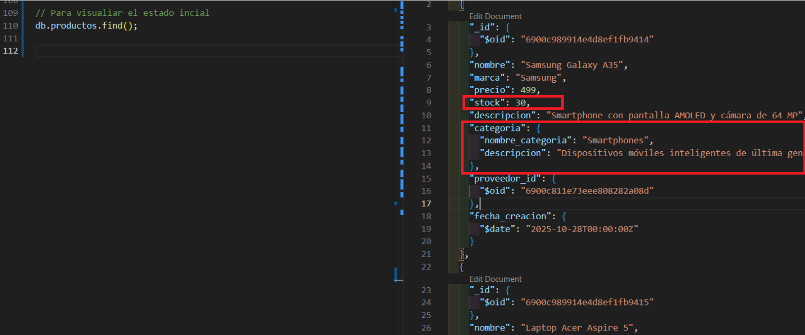

#### Actualizar datos

Visualizar el stock antes de los smartphones antes de actualizar.

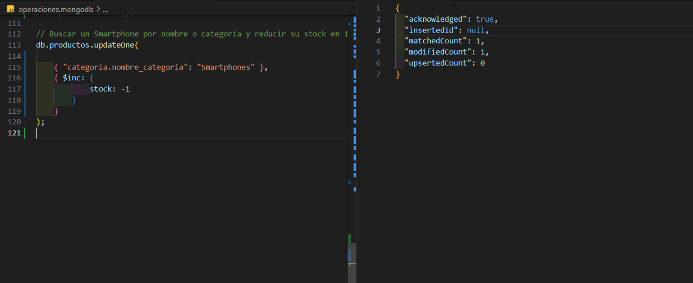

#### Comprobar

Se listo nuevamente el documento para ver los cambios en stock.

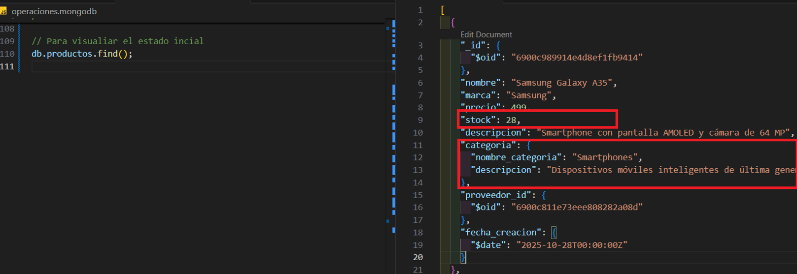

#### Visualizar datos

Se procedio a realizar otra actualizacion, para ello se visualiza  antes de actualizar.

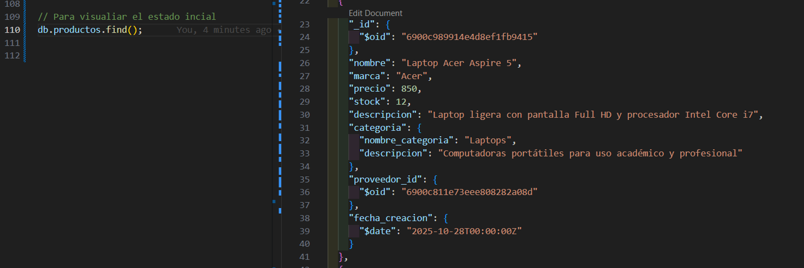

#### Actualizar datos

Se agrega un nuevo campo al documento que pertenezca a la categoria Laptops.

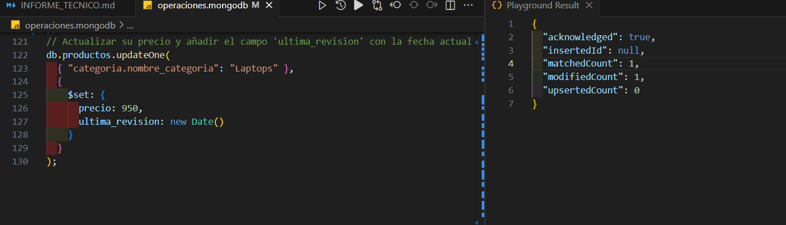

#### Comprobar

Se listo nuevamente el documento para ver el nuevo campo agregado.

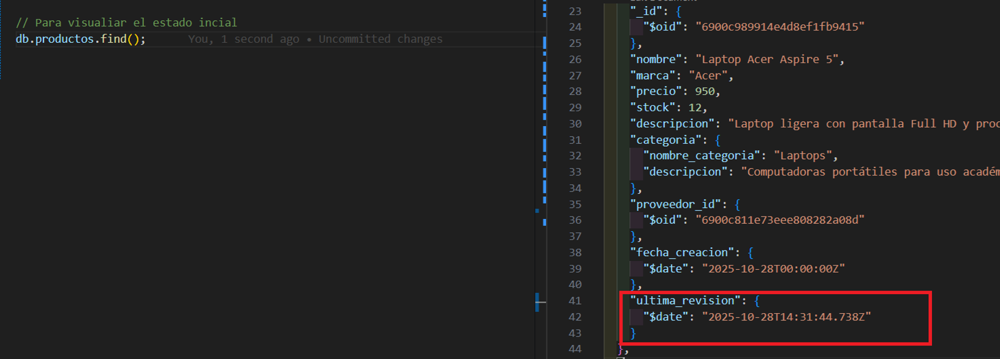

### Coleccion de MongoDB en VSC

Estado de la Coleccion de Mongo DB Atlas visualizada en la extension de Visual Studio Code

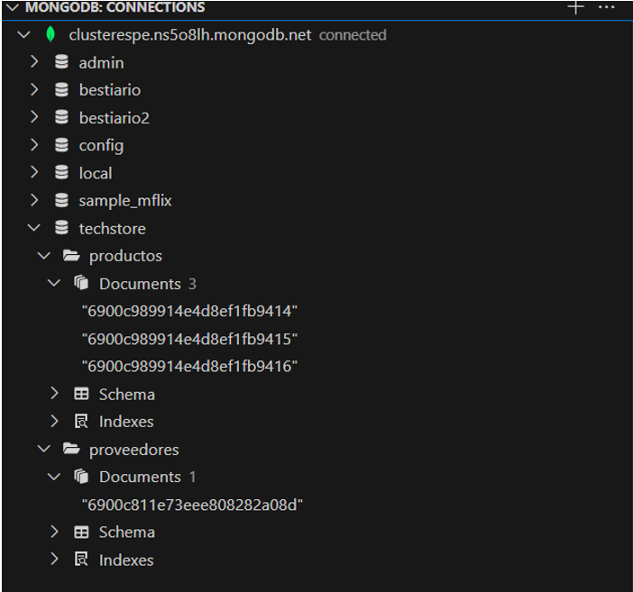

## Análisis Reflexivo

#### **Pregunta 1:**  
**¿Cuál fue la ventaja más significativa de usar un modelo de documento (MongoDB) para el caso "TechStore" en comparación con el modelo relacional que diseñó?**  
La principal ventaja del modelo de documentos en MongoDB fue la **reducción de la complejidad estructural** y el **mejor rendimiento de lectura**.  
En el modelo relacional, para obtener información completa de un producto se requerían varias relaciones entre tablas como `Producto`, `Categoría` y `Proveedor`.  
En cambio, en MongoDB toda la información relevante se encuentra **en un solo documento**, permitiendo consultas más simples y rápidas.  
Esto mejora la escalabilidad horizontal y facilita la manipulación de datos en tiempo real, ideal para entornos con catálogos dinámicos como “TechStore”.

---

#### **Pregunta 2:**  
**¿Cómo facilita el anidamiento de documentos (el campo especificaciones) la gestión de datos heterogéneos (diferentes atributos por producto)?**  
El anidamiento de documentos permite **adaptar la estructura interna** de cada producto según sus características específicas, sin necesidad de modificar el esquema general.  
Por ejemplo, un *Smartphone* puede incluir los campos `pantalla`, `ram_gb` y `bateria_mAh`, mientras que una *Laptop* puede tener `cpu`, `dimensiones` y `peso_kg`.  
Esta capacidad de representar datos heterogéneos en un mismo conjunto **aumenta la flexibilidad** del modelo y elimina la necesidad de estructuras complejas o múltiples tablas auxiliares, algo que sería más costoso en un sistema SQL.

---

#### **Pregunta 3:**  
**¿Qué problemas potenciales podría enfrentar esta base de datos a futuro si no se controla la flexibilidad del esquema (es decir, si se permite insertar cualquier dato)?**  
El principal riesgo es la **pérdida de consistencia e integridad de los datos**.  
Si no se establecen reglas de validación, distintos documentos podrían contener campos con nombres o tipos incoherentes (`precio` como texto, `stock` negativo, etc.), lo que dificultaría los reportes, las búsquedas y el mantenimiento.  
Además, la ausencia de control de tipos puede generar **duplicidad de información** y errores en los cálculos de inventario o ventas.  
Es importante implementar un **JSON Schema** en cada colección para garantizar la uniformidad y validez de los datos insertados.

---

#### **Pregunta 4:**  
**¿Qué paso técnico recomendaría a continuación para “profesionalizar” esta base de datos? (Piense en rendimiento e integridad de datos que no cubrimos en este laboratorio).**  
Para profesionalizar la base de datos se recomienda:  
1. Implementar **JSON Schema Validators** en las colecciones `productos` y `proveedores` para definir tipos de datos y campos obligatorios.  
2. Crear **índices** en los campos más consultados, como `sku`, `tipo_producto` y `proveedor_id`, para mejorar el rendimiento de las consultas.  
3. Incorporar **copias de respaldo automáticas (backups)** y habilitar la **replicación** para garantizar disponibilidad ante fallos.  
4. Integrar un **sistema de autenticación y roles** (con `role-based access control`) para proteger la base de datos y delimitar privilegios de lectura y escritura según el usuario.
